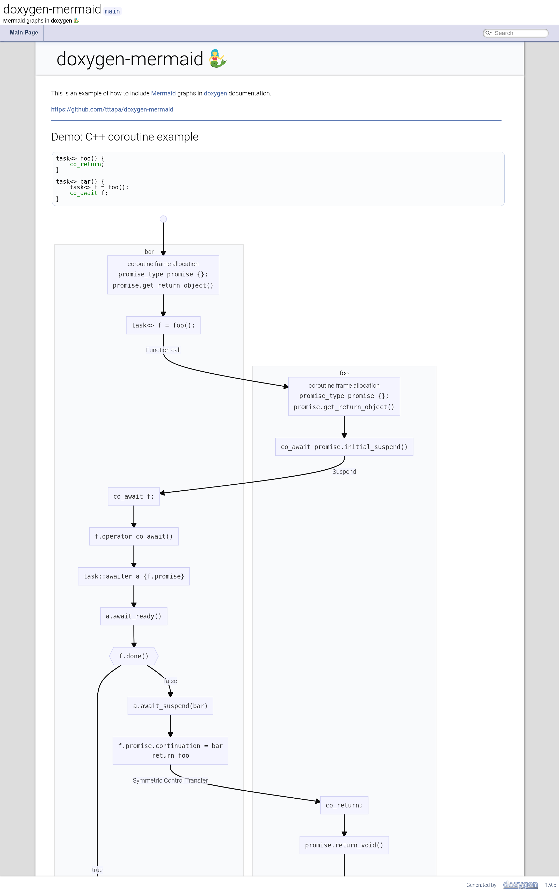

# doxygen-mermaid 🧜‍♀️

This is an example of how to include [Mermaid](https://mermaid-js.github.io/mermaid) graphs in [doxygen](https://www.doxygen.nl/index.html) documentation.

You can view the result at https://tttapa.github.io/doxygen-mermaid/Doxygen.



## Step-by-step instructions

1. Add the Mermaid JavaScript code to the doxygen header and footer.
   Use the following command to generate the HTML files:
    ```sh
    doxygen -w html header.html footer.html stylesheet.css
    ```
    You can remove the stylesheet, we don't need it for this guide.
    Add the following script after the opening `<body>` tag in `header.html`
    ```html
    <script src="https://cdn.jsdelivr.net/npm/mermaid/dist/mermaid.min.js"></script>
    ```
    and add the following script before the closing `</body>` tag in footer.html. Feel free to [change the theme](https://mermaid-js.github.io/mermaid/#/theming).
    ```html
    <script>
      mermaid.initialize({
        startOnLoad: true,
        theme: 'base', 
        themeVariables: {
          primaryColor: '#f4f4ff',
          secondaryColor: 'rgba(244,244,255,0.9)',
          tertiaryColor: '#F9FAFC',
        },
      });
    </script>
    ```
2. Make doxygen use the custom HTML header and footer by adding the following options to your Doxyfile:
    ```sh
    HTML_HEADER = header.html
    HTML_FOOTER = footer.html
    ```
3. Add a doxygen alias command for Mermaid graphs. Edit the `ALIASES` option in your Doxyfile to include:
    ```sh
    ALIASES = mermaid{1}="@htmlonly <div class=\"mermaid\"> ^^ @endhtmlonly @htmlinclude \"\1.mmd\" @htmlonly ^^ </div> @endhtmlonly"
    ```
4. Add the `graphs` folder to your doxygen example path by editing the `EXAMPLE_PATH` option in your `Doxyfile`:
    ```sh
    EXAMPLE_PATH = graphs
    ```
5. Add some Mermaid graph files with extension `.mmd` in the `graphs` folder.
6. Include the graphs somewhere in the documentation using the `@mermaid` command:
    ```cpp
    /**
     * @mermaid{filename}
     */
    ```
    (With `filename` the filename of the graph without the `.mmd` extension.)